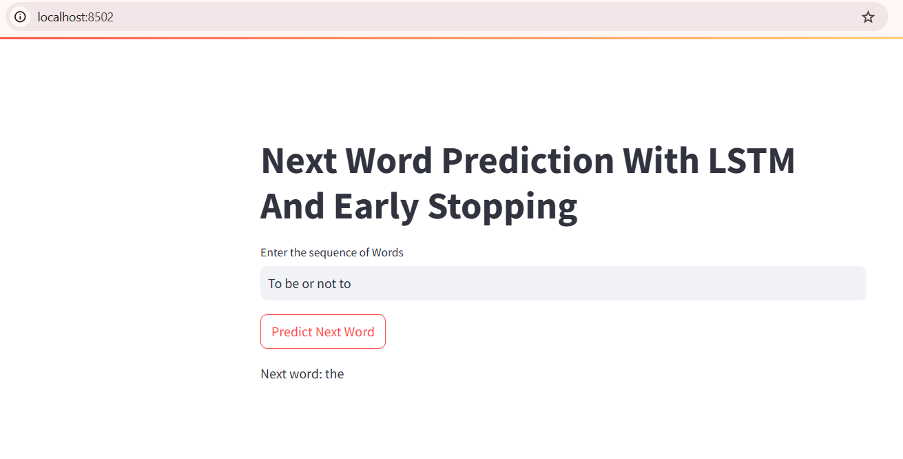
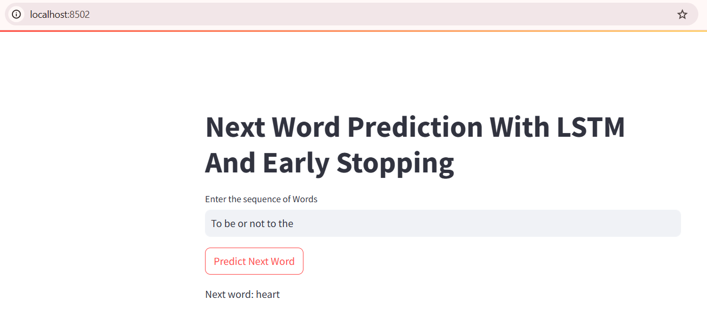
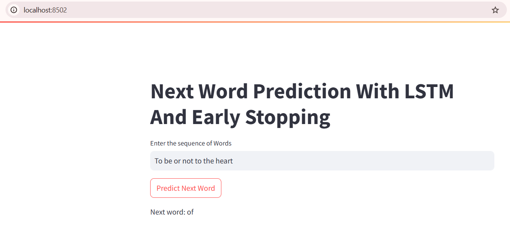

# Next Word Prediction using LSTM RNN

This project demonstrates the implementation of a Next Word Prediction model using Long Short-Term Memory (LSTM) Recurrent Neural Networks (RNN). The model is trained to predict the next word in a given sequence of words.

## Table of Contents
# Next Word Prediction using LSTM RNN

This project implements a **Next Word Prediction** system using a **Long Short-Term Memory (LSTM)** Recurrent Neural Network (RNN). The model is trained on text data from Shakespearean plays and predicts the next word in a sequence based on the provided input text. This project serves as a demonstration of Natural Language Processing (NLP) using deep learning.

---

## Table of Contents

- [Features](#features)
- [Project Structure](#project-structure)
- [Explanation of Code Files](#explanation-of-code-files)
  - [experiments.ipynb](#1-experimentsipynb)
  - [app.py](#2-apppy)
  - [requirements.txt](#3-requirementstxt)
  - [Text Files](#4-text-files-caesartxt-hamlettxt-macbethtxt)
  - [tokenizer.pickle](#5-tokenizerpickle)
  - [Model Files](#6-model-files-next_word_lstm_model_with_early_stoppingh5-next_word_lstmh5)
- [How to Run the Project](#how-to-run-the-project)
  - [Install Dependencies](#1-install-dependencies)
  - [Train the Model (Optional)](#2-train-the-model-optional)
  - [Run the Flask Application](#3-run-the-flask-application)
- [Results](#results)
- [Technologies Used](#technologies-used)
- [Future Work](#future-work)
- [Acknowledgments](#acknowledgments)
- [Output](#output)

# Next Word Prediction using LSTM RNN

This project implements a **Next Word Prediction** system using a **Long Short-Term Memory (LSTM)** Recurrent Neural Network (RNN). The model is trained on text data from Shakespearean plays and predicts the next word in a sequence based on the provided input text. This project serves as a demonstration of Natural Language Processing (NLP) using deep learning.

---

## Features

- Uses an LSTM-based RNN architecture for sequential text prediction.
- Trained on classical texts, including *Hamlet*, *Macbeth*, and *Julius Caesar* by William Shakespeare.
- Employs **tokenization** for preprocessing and **early stopping** to prevent overfitting during training.
- Includes a Flask web application for deploying and testing the model interactively.

---

## Project Structure

```plaintext
├── app.py                          # Flask app for deploying the model
├── caesar.txt                      # Text data: Julius Caesar
├── experiments.ipynb               # Jupyter notebook for training and analysis
├── final.txt                       # Combined dataset used for training
├── hamlet.txt                      # Text data: Hamlet
├── macbeth.txt                     # Text data: Macbeth
├── next_word_lstm_model_with_early_stopping.h5  # Trained LSTM model
├── next_word_lstm.h5               # Alternative version of the trained model
├── output/
│   ├── 1.png                       # Visualization or results image
│   ├── 2.png                       # Visualization or results image
│   ├── 3.png                       # Visualization or results image
├── readme.md                       # Project documentation (this file)
├── requirements.txt                # Python dependencies
├── tokenizer.pickle                # Tokenizer for text preprocessing
```

---

## Explanation of Code Files

### 1. **`experiments.ipynb`**
This notebook contains:
- **Data Preprocessing**:
  - Tokenization of text using Keras' `Tokenizer`.
  - Sequence padding to ensure consistent input length.
- **Model Building**:
  - LSTM architecture with embedding layers for word representations.
  - Use of dropout layers to prevent overfitting.
- **Training**:
  - Trained on the dataset using categorical cross-entropy loss and Adam optimizer.
  - Implements early stopping to monitor validation loss.
- **Evaluation**:
  - Performance metrics and visualizations of loss and accuracy.

### 2. **`app.py`**
This is the Flask application for deploying the trained model. Key components:
- **Route Definitions**:
  - `/`: Home page with an input box for users to enter text.
  - `/predict`: Endpoint for predicting the next word based on user input.
- **Model Loading**:
  - Loads the trained LSTM model (`next_word_lstm_model_with_early_stopping.h5`).
  - Loads the tokenizer (`tokenizer.pickle`) for text preprocessing.
- **Prediction Logic**:
  - Processes the input text, predicts the next word, and returns the result.

### 3. **`requirements.txt`**
Lists all the Python dependencies required for the project, including:
- `Flask`
- `TensorFlow`
- `Keras`
- `numpy`
- `pandas`

### 4. **Text Files (`caesar.txt`, `hamlet.txt`, `macbeth.txt`)**
These files contain raw text data from Shakespearean plays used for training the model.

### 5. **`tokenizer.pickle`**
Serialized tokenizer object used to preprocess input text during training and prediction.

### 6. **Model Files (`next_word_lstm_model_with_early_stopping.h5`, `next_word_lstm.h5`)**
- **`next_word_lstm_model_with_early_stopping.h5`**: The final trained model with early stopping applied.
- **`next_word_lstm.h5`**: Another version of the trained model.

---

## How to Run the Project

### 1. Install Dependencies

Install the required Python libraries by running:

```bash
pip install -r requirements.txt
```

### 2. Train the Model (Optional)

To retrain the model, open `experiments.ipynb` and follow the steps for data preprocessing, model training, and evaluation.

### 3. Run the Flask Application

Execute the following command to start the Flask app:

```bash
python app.py
```

Access the application at `http://127.0.0.1:5000`.

---

## Results

The trained model predicts the next word in a sequence with high accuracy. Below are some example visualizations of the results:





---

## Technologies Used

- **Python**: Programming language
- **TensorFlow/Keras**: For building and training the LSTM model
- **Flask**: For deploying the model as a web application
- **Jupyter Notebook**: For experimentation and analysis

---

## Future Work

- Train the model on a larger and more diverse dataset.
- Optimize the model architecture for improved performance.
- Extend the Flask app to handle real-time user input dynamically.

---

## Acknowledgments

- Text data sourced from public domain works of William Shakespeare.
- Inspired by NLP applications in AI and machine learning.

---

## Output


